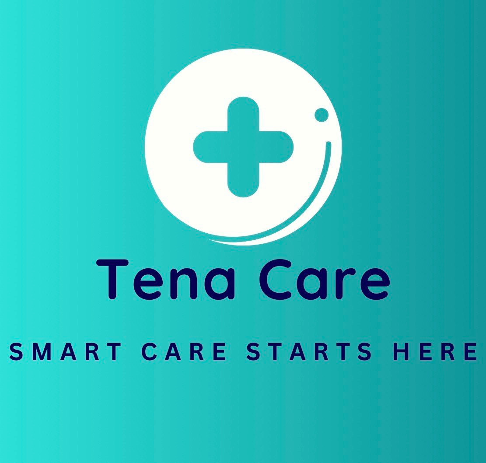

# TenaCare — Digital Medical Prescription & Fulfillment Portal

  

**Supporting Mental Well-Being in Healthcare**

As people reach older age, health-related problems become a major challenge — and our app helps them manage their prescriptions.

**TenaCare** is a web platform that eliminates the dangers of unreadable medical handwriting, lost/mishandled prescriptions, and the exhausting struggle of "medication hunting" across cities. By digitizing the end-to-end pharmaceutical lifecycle, **TenaCare** bridges the gap between clinical prescription issuance and pharmacy fulfillment (with home-delivery workflows planned).

---

## Programming Features Used

| Layer | Technology |
|-------|------------|
| **Frontend** | TypeScript, React 18, Vite, Tailwind CSS |
| **Backend** | Node.js, Express |
| **Database** | SQLite (`better-sqlite3`) + browser mock store for offline demos |

---

## Key Advantages & Core Features

  

- **National Fayda ID sync** — Patients use their unique Fayda ID (FIN) to sign in, pull, and verify active electronic prescriptions at participating hospital nodes and pharmacy hubs in Ethiopia.
- **Cognitive & behavioral health safeguards** — Built for vulnerable users (Alzheimer's, dementia, advanced cognitive issues) who cannot use technology alone. Credentialed doctors act on their behalf and route orders to fulfillment.
- **Smart caregiver alarm & reminder system** — Doctor-prescribed **course length (days)**, **dose times**, and patient-set alarms keep family caregivers synchronized when medication is due.
- **Patient SOS (demo)** — Hold-to-alert emergency flow with caregiver quick-call and alert history.
- **Instant sync loop** — When a doctor issues a prescription, it appears on the pharmacy and patient views without slow paper channels (mock/API mode).

---

## The 4-Interface System Architecture

TenaCare separates professional boundaries into four secure dashboard routes:

1. **Doctor portal** — Clinical dashboard: patient lookup by Fayda ID, EHR notes, digital prescriptions (medication, dosage, schedule, days of therapy, dose times).
2. **Pharmacist terminal** — Dispensary queue: retrieve Rx by Fayda ID, review doctor notes, mark **Pending → Dispensed**.
3. **Central administrative panel** — Oversight for supervisors: patient registry, prescription volume, staff accounts, Fayda-linked compliance view.
4. **Patient prescription tracking portal** — Mobile-first app: active medications, doctor schedule + alarms, profile (Fayda FIN), and SOS.

| Portal | URL | Demo login |
|--------|-----|------------|
| Patient | `/patient/login` | Fayda FIN e.g. `123456789012` |
| Doctor | `/doctor/login` | `doctor@tanecare.et` / `doctor123` |
| Pharmacy | `/pharmacy/login` | `pharmacy@tanecare.et` / `pharmacy123` |
| Admin | `/admin/login` | `admin@tanecare.et` / `admin123` |

### Demo patient Fayda IDs

| FIN | Name |
|-----|------|
| `123456789012` | Sarah Johnson (Family Core — demo) |
| `234567890123` | Abebe Tadesse |
| `345678901234` | Helen Girma |
| `456789012345` | Dawit Mekonnen |
| `567890123456` | Ruth Haile |
| `678901234567` | Yonas Bekele |
| `789012345678` | Meron Assefa |
| `890123456789` | Tigist Worku |

---

## How the Code Works

- **Type contract layer (`src/types/index.ts`)** — TypeScript interfaces for patients, prescriptions, staff, alarms, health records, and workflow states to prevent runtime shape bugs.
- **Mock / persistence layer (`src/data/mockStore.ts`)** — In-memory demo data plus `localStorage` for alarms, SOS history, and profile overrides. Ensures offline resilience during live demos with no server timeout risk on refresh.
- **API client (`src/api/client.ts`)** — Switches between mock store and Express API when `VITE_USE_API=true`.
- **React UI (`src/pages/`, `src/components/`)** — Route-based portals (patient, doctor, pharmacy, admin); components render live data from hooks (`useApiData`) and update views when prescriptions or alarms change.
- **SQLite backend (`server/`)** — Optional persistent database (`server/tanecare.db`) with seeded staff, patients, prescriptions, and health records.
