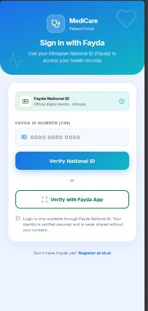

# Tena Care

<div align="center">


### Smart care starts here

**Digital medical prescription & fulfillment · Fayda-linked · Built for mental health & Alzheimer’s care**

[](https://github.com/royalsecond3-droid/Pharma)

</div>

---

## About

**Tena Care** is a web platform that connects patients, doctors, pharmacies, and administrators through Ethiopia’s **Fayda National Digital ID**. It reduces prescription errors from handwriting, lost paper scripts, and “medication hunting” across cities by digitizing the full flow from clinical prescribing to pharmacy fulfillment.

The product is designed for **older adults** and people with **Alzheimer’s, dementia, or cognitive challenges** — including workflows where doctors and caregivers act on a patient’s behalf while the patient uses simple reminders, schedules, and **SOS** tools.

---

## Screenshots

| Brand | Patient login (Fayda) |
|:-----:|:---------------------:|
|  |  |

---

## Quick start

```bash
pnpm install
pnpm dev
```

Open **http://localhost:5173** — the app runs with **built-in mock data** (no API required).

| Command | Description |
|---------|-------------|
| `pnpm dev` | Frontend only (mock mode) |
| `pnpm dev:all` | Frontend + API on port `3001` |
| `pnpm build` | Production build |
| `pnpm preview` | Preview production build |

**Live API mode** (optional):

```bash
VITE_USE_API=true pnpm dev:all
```

Reset SQLite seed data:

```bash
rm -f server/tanecare.db && pnpm dev:all
```

---

## Portals & demo access

| Portal | URL | How to sign in |
|--------|-----|----------------|
| **Landing** | `/` | Choose a portal |
| **Patient** | `/patient/login` | Fayda FIN (12+ digits) — see table below |
| **Doctor** | `/doctor/login` | `doctor@tanecare.et` / `doctor123` |
| **Pharmacy** | `/pharmacy/login` | `pharmacy@tanecare.et` / `pharmacy123` |
| **Admin** | `/admin/login` | `admin@tanecare.et` / `admin123` |

Staff portals include **Continue with demo account** for one-click login.

### Demo patient Fayda IDs

| FIN | Patient |
|-----|---------|
| `123456789012` | Sarah Johnson |
| `234567890123` | Abebe Tadesse |
| `345678901234` | Helen Girma |
| `456789012345` | Dawit Mekonnen |
| `567890123456` | Ruth Haile |
| `678901234567` | Yonas Bekele |
| `789012345678` | Meron Assefa |
| `890123456789` | Tigist Worku |

---

## Features

### Patient app (mobile-first)

- **Fayda-only login** — National ID verification (demo)
- **Home** — active prescriptions overview
- **Meds** — full prescription list with search & filters
- **Schedule** — doctor-prescribed course length (days), dose times, and **medication alarms**
- **SOS** — hold-to-alert caregiver (demo), quick-call links, alert history
- **Profile** — Fayda FIN, contact info, secure logout

### Doctor portal

- Patient lookup & registry by Fayda ID
- Digital prescriptions (medication, dosage, **days of therapy**, dose times)
- Electronic health records (EHR) notes
- Patient list with prescription counts

### Pharmacy portal

- Lookup patient by Fayda ID
- View active prescriptions
- Mark medications as **dispensed**

### Admin portal

- Platform stats (patients, prescriptions, fulfillment)
- Patient registry
- All prescriptions & staff accounts

---

## Tech stack

| Layer | Technology |
|-------|------------|
| **Frontend** | React 18, TypeScript, Vite 6, Tailwind CSS 4, React Router 7 |
| **Backend** | Node.js, Express |
| **Database** | SQLite (`better-sqlite3`) |
| **Patient auth** | Fayda FIN |
| **Staff auth** | Email + password (role: doctor / pharmacy / admin) |

**Mock mode (default):** all data in browser memory + `localStorage` — ideal for demos and judging offline.

**API mode:** set `VITE_USE_API=true` to use the Express API and `server/tanecare.db`.

---

## Project structure

```
├── public/                 # Logo & static assets
├── server/                 # Express API + SQLite
│   ├── index.ts
│   ├── db.ts
│   └── seedMockData.ts
├── src/
│   ├── app/App.tsx         # Routes (4 portals)
│   ├── api/client.ts       # API + mock switch
│   ├── data/mockStore.ts   # Demo data
│   ├── pages/              # Patient, doctor, pharmacy, admin UI
│   └── components/         # Shared UI (Fayda lookup, SOS, schedule)
├── image.png               # Logo (README)
└── image copy.png          # Login UI reference (README)
```

---

## How it works

1. **Doctor** issues a prescription linked to a patient’s Fayda ID (duration in days + daily dose times).
2. **Pharmacy** retrieves the same ID, verifies Rx, and marks fulfillment.
3. **Patient** sees meds and sets **alarms** on the prescribed schedule; **SOS** notifies caregivers in demo mode.
4. **Admin** monitors usage across the network.

---

## Repository

**GitHub:** https://github.com/royalsecond3-droid/Pharma

```bash
git clone https://github.com/royalsecond3-droid/Pharma.git
cd Pharma
pnpm install && pnpm dev
```

---

## License

Private / hackathon project — see repository owner for usage terms.
